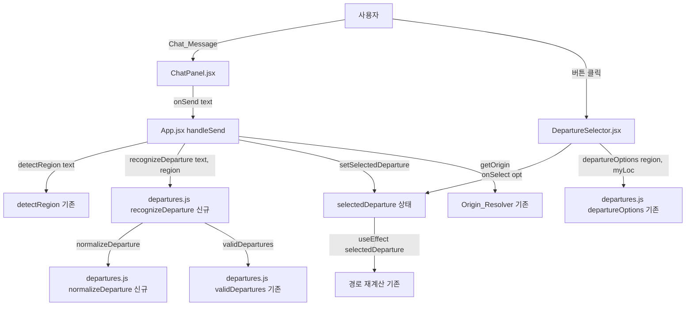
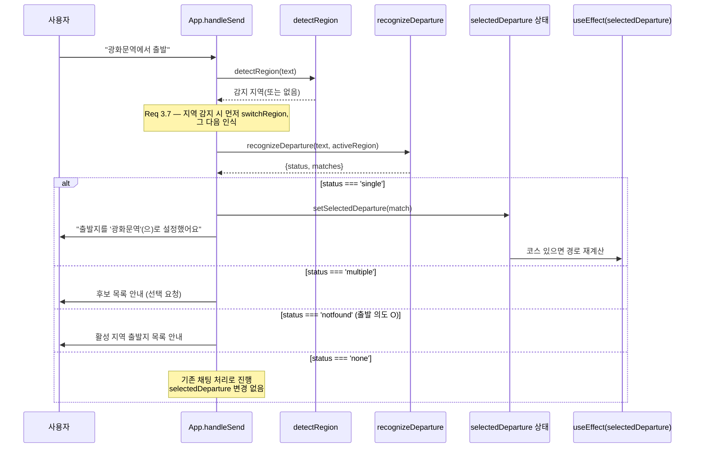

# Design Document: chat-departure-recognition

## Overview

이 기능은 "편해질지도"(barrier-free-travel)의 출발지 기능을 두 축으로 확장한다.

1. **출발지 다중화(Departure Registry 확장)**: 현재 각 지역이 정확히 2개만 가진 `departures` 배열을, 지역당 N개(≥2)의 잘 알려진 출발지(주요 역·터미널·랜드마크)로 확장한다. 각 출발지에 선택적 `aliases` 필드를 추가하되, 기존 `departures.js`의 `validateDeparture`/`validDepartures`/`departureOptions` 검증 파이프라인과 완전히 하위 호환된다.

2. **채팅 기반 출발지 인식(Departure Recognizer)**: 사용자가 채팅에 "광화문역에서 출발", "시청에서 시작할게", "서울역" 등을 입력하면, 활성 지역의 출발지 후보 중에서 이름/별칭/부분 일치로 인식해 `selectedDeparture`로 설정한다. 버튼 선택과 동일한 상태를 공유하고, 코스가 있으면 기존 `selectedDeparture` useEffect가 경로를 재계산한다.

이 기능은 **프론트엔드 전용**이다. 백엔드(FastAPI)는 변경하지 않는다. 지역/출발지 도메인 로직은 이미 `App.jsx`(REGIONS, `detectRegion`, `getOrigin`, `handleSend`)와 `departures.js`(순수 함수)에 있으므로, 인식 로직은 `departures.js`에 순수 함수로 추가해 테스트 용이성을 극대화한다. 모든 변경은 기존 흐름에 **추가(additive)** 되는 방식으로, 채팅 인식과 버튼 선택이 공존하며 상태를 동기화한다.

### 설계 목표

- **하위 호환**: `aliases`가 없는 기존 출발지 정의도 그대로 동작한다. `getOrigin` 우선순위와 `origin` getter 동작은 변경하지 않는다.
- **테스트 용이성**: 인식 로직은 부수효과 없는 순수 함수(`recognizeDeparture`, `normalizeDeparture`)로 구현해 property-based test가 가능하게 한다.
- **UI 단순성**: `DepartureSelector`에는 표시 임계값 기반 "더 보기" 토글만 추가한다.
- **관심사 분리**: 인식(pure logic)은 `departures.js`에, 상태 전이·채팅 응답(side effects)은 `App.jsx`에 둔다.

## Architecture

### 컴포넌트 관계



### 데이터 흐름: 채팅 출발지 인식



### 인식과 지역 전환의 순서 (Req 3.7)

`handleSend`는 다음 순서를 지킨다.

1. `detectRegion(text)`로 지역 감지.
2. 감지된 지역이 `ready`이고 현재 지역과 다르면 `switchRegion(detected)` 실행 — 이때 `selectedDeparture`가 초기화된다(기존 동작, Req 2.6).
3. **지역 전환 후** 최종 활성 지역(`active`)을 기준으로 `recognizeDeparture(text, active)`를 실행.

이 순서 덕분에 "부산 해운대역에서 출발"처럼 지역+출발지를 함께 말해도, 부산으로 전환한 뒤 부산의 출발지 목록에서 해운대역을 인식한다.

## Components and Interfaces

### 1. `departures.js` — 신규 순수 함수

#### `normalizeDeparture(text: string): string`

매칭을 위한 정규화 문자열을 만든다.

- 앞뒤 공백 제거(trim).
- 조사·출발 의도 표현 제거: `에서`, `에`, `서`, `부터`, `출발`, `시작`, `갈게`, `갈래`, `할게`, `요` 등 후위 표현을 제거.
- 접미사 동등화: 후행 `역`, `터미널`, `시청` 접미사를 제거해, `시청`이 `시청역`과 매칭되도록 한다(Req 3.4). 단, 접미사 제거는 "정규화 키" 생성에만 쓰고 원본 이름은 응답 메시지에 그대로 사용한다.
- 내부 공백 정규화(연속 공백 → 단일 공백).

반환값은 소문자화하지 않는다(한글은 대소문자 없음). 라틴 문자가 섞인 경우에만 소문자화한다.

#### `recognizeDeparture(text: string, region: object): RecognitionResult`

활성 지역의 유효 출발지(`validDepartures(region)`)를 대상으로 채팅 입력을 매칭한다.

매칭 절차(정밀도 우선순위):

1. **exact full-name**: 정규화된 입력이 어떤 출발지의 정규화된 `name`과 정확히 같거나, 입력이 그 정규화 이름을 부분 문자열로 포함하고 다른 후보와 충돌하지 않으면 단일 매칭.
2. **alias exact**: 정규화 입력이 어떤 출발지의 `aliases` 항목(정규화)과 정확히 같으면 매칭.
3. **partial/substring**: 정규화 입력이 출발지 이름/별칭의 정규화 키를 부분 문자열로 포함(또는 그 반대)하면 후보에 추가.

각 단계에서 매칭 후보를 모으고, **가장 높은 정밀도 단계에서 매칭된 후보 집합**을 결과로 삼는다(낮은 정밀도 단계는 상위 단계에 매칭이 없을 때만 사용). 최종 후보 집합의 중복(같은 출발지)을 제거한 뒤 개수로 분류한다.

반환 형태:

```
{
  status: 'single' | 'multiple' | 'none' | 'notfound',
  matches: DeparturePoint[],   // status에 따라 0개/1개/N개
  intent: boolean              // 출발 의도 표현(에서/출발/시작 등) 포함 여부
}
```

분류 규칙:

- 후보 1개 → `status: 'single'`, `matches: [dep]`.
- 후보 2개 이상 → `status: 'multiple'`, `matches: [...deps]`.
- 후보 0개 & 출발 의도 표현 있음 → `status: 'notfound'`, `matches: []`, `intent: true`.
- 후보 0개 & 출발 의도 표현 없음 → `status: 'none'`, `matches: []`, `intent: false`.

이 함수는 순수 함수다. React 상태나 DOM에 접근하지 않으며, `validDepartures`의 `console.warn` 외 부수효과가 없다.

### 2. `DepartureSelector.jsx` — "더 보기" 토글 추가 (Req 2.3)

- `DISPLAY_THRESHOLD` 상수(기본 3)를 도입.
- `departureOptions(region, myLoc)`가 반환한 옵션 수가 임계값을 초과하면, 처음 `DISPLAY_THRESHOLD`개만 표시하고 나머지는 "더 보기(N)" 버튼으로 펼친다. 펼친 뒤엔 "접기" 버튼으로 되돌릴 수 있다.
- 토글 상태는 `useState(false)`로 관리하며, `region` 변경 시 접힘 상태로 초기화(`useEffect([region.id])`).
- 임계값 이하이면 토글 없이 전부 표시(기존 동작과 동일).
- props 시그니처(`region`, `selected`, `myLoc`, `onSelect`)는 변경하지 않는다.

### 3. `App.jsx` — `handleSend` 통합 (Req 3, 4, 5, 6)

`handleSend`의 지역 감지 직후, 코스 생성 로직(`postChat`) **이전에** 출발지 인식 분기를 삽입한다.

```
// 1) 지역 감지 및 전환 (기존 + Req 3.7 순서 보장)
const detected = detectRegion(text)
// ... 미지원 지역 안내 (기존) ...
const active = detected && detected.id !== region.id ? detected : region
if (active.id !== region.id) { switchRegion(active); /* 안내 메시지 */ }

// 2) 출발지 인식 (신규)
const rec = recognizeDeparture(text, active)
if (rec.status === 'single') {
  setSelectedDeparture(rec.matches[0])
  setMessages(m => [...m, { role:'assistant',
    content:`출발지를 '${rec.matches[0].name}'(으)로 설정했어요` }])
  return   // 코스 생성으로 진행하지 않음 — 출발지 설정만 수행
}
if (rec.status === 'multiple') {
  setMessages(m => [...m, { role:'assistant',
    content:`여러 출발지가 매칭돼요: ${rec.matches.map(d=>d.name).join(', ')}. 하나를 골라주세요.` }])
  return
}
if (rec.status === 'notfound') {   // 출발 의도는 있으나 매칭 0
  const names = validDepartures(active).map(d=>d.name).join(', ')
  setMessages(m => [...m, { role:'assistant',
    content:`'${active.name.split(' ·')[0]}'에서 고를 수 있는 출발지: ${names}. 이 중에서 말씀해주세요.` }])
  return
}
// rec.status === 'none' → 아래 기존 채팅/코스 처리로 진행 (selectedDeparture 유지)
```

- **단일 인식 시 `return`**: 출발지 설정은 코스 생성과 독립적이다. 설정 후 즉시 종료하고, 코스가 이미 있으면 `selectedDeparture` useEffect가 경로를 재계산한다(Req 5.3~5.6). 코스가 없으면 다음 코스 생성 시 origin으로 사용된다(Req 5.6).
- **Req 3.7 순서**: 인식은 항상 `active`(전환 후 지역)를 대상으로 한다.
- **Req 4.4(다른 지역 출발지)**: `active`가 현재 지역인데 입력이 다른 지역 출발지만 지칭하면, `recognizeDeparture(text, active)`는 `active` 후보에서 매칭이 없으므로 `notfound`로 처리되어 활성 지역 출발지 목록을 안내한다. 이는 Req 4.4의 "활성 지역에서 사용 불가" 안내와 동일한 사용자 결과를 제공한다.

### 4. 경로 재계산 useEffect (기존 재사용, Req 5.3~5.6)

`App.jsx`의 기존 `useEffect([selectedDeparture])`가 이미 다음을 처리한다.

- 코스 존재 시 새 출발지로 경로 재계산 + 요약 메시지(Req 5.3, 5.4).
- 실패 시 실패 메시지 + 이전 경로 유지(Req 5.5).
- 코스 없으면 재계산하지 않고 출발지만 유지(Req 5.6).

따라서 채팅 인식은 `setSelectedDeparture`만 호출하면 재계산 동작을 그대로 재사용한다. **추가 구현 불필요**하며, 이는 버튼 선택과 채팅 인식이 동일 경로로 수렴함(Req 5.2, 6.1~6.3)을 보장한다.

## Data Models

### DeparturePoint (확장)

기존 형태에 선택적 `aliases`를 추가한다.

```
{
  name: string,        // 1~60자 (기존)
  lat: number,         // -90~90, region.bbox 내부 (기존)
  lng: number,         // -180~180, region.bbox 내부 (기존)
  type: string,        // {지하철역, 버스터미널, 주차장} (기존)
  aliases?: string[]   // 선택 — 채팅에서 이 출발지를 지칭하는 대체 표기 (신규)
}
```

- `aliases`는 선택 필드다. 없으면 `[]`로 취급한다. `validateDeparture`는 `aliases`를 검사하지 않으므로(무시) 완전 하위 호환이다.
- 예: `{ name:'서울역', ..., aliases:['서울역'] }`, `{ name:'광화문역', ..., aliases:['광화문'] }`, `{ name:'시청역', ..., aliases:['시청','서울시청'] }`.

### Departure_Registry 확장 (Req 1.1~1.4)

각 지역 `departures` 배열을 실좌표(bbox 내부) 기반 N개로 확장한다. 아래는 계획된 목록이며, 모든 좌표는 해당 지역 bbox 내부여야 한다(Req 1.3). 지하철 운행 지역은 ≥1 지하철역을 포함한다(Req 1.4). `departures[0]`은 기존 `origin` getter가 가리키므로 대표 거점을 유지한다(Req 1.6).

| 지역 | 계획 출발지 (name / type / alias 예) |
|------|--------------------------------------|
| 서울 | 광화문역(지하철역/광화문), 서울역(지하철역/서울역), 시청역(지하철역/시청·서울시청), 종로3가역(지하철역/종로) |
| 경주 | 경주시외버스터미널(버스터미널/경주터미널), 대릉원 공영주차장(주차장/대릉원), 경주고속버스터미널(버스터미널) |
| 부산 | 해운대역(지하철역/해운대), 센텀시티역(지하철역/센텀), 부산종합버스터미널(버스터미널/노포) |
| 전주 | 한옥마을 공영주차장(주차장/한옥마을), 전주고속버스터미널(버스터미널/전주터미널), 전주시외버스터미널(버스터미널) |
| 강릉 | 강릉역(버스터미널/강릉역), 강릉시외버스터미널(버스터미널), 강릉고속버스터미널(버스터미널) |
| 여수 | 여수엑스포역(버스터미널/엑스포), 여수종합버스터미널(버스터미널/여수터미널), 이순신광장 공영주차장(주차장/이순신광장) |
| 제주 | 제주버스터미널(버스터미널/제주터미널), 제주국제공항 주차장(주차장/제주공항·공항), 동문시장 공영주차장(주차장/동문시장) |
| 수원 | 수원역(지하철역/수원역), 팔달문(주차장/팔달문·행궁), 수원종합버스터미널(버스터미널) |
| 인천 | 인천역(지하철역/인천역·차이나타운), 인천종합버스터미널(버스터미널/인천터미널), 동인천역(지하철역/동인천) |
| 대구 | 반월당역(지하철역/반월당), 동대구역(지하철역/동대구), 대구고속버스터미널(버스터미널/동대구터미널) |

> 구현 시 실제 좌표는 기존 2개 출발지의 검증된 좌표를 재사용하고, 추가 지점은 공개 좌표를 bbox 내부로 확인해 채운다. `origin` getter와 `getOrigin` 우선순위는 변경하지 않는다.

### RecognitionResult (신규)

```
{
  status: 'single' | 'multiple' | 'none' | 'notfound',
  matches: DeparturePoint[],
  intent: boolean
}
```

| status | 의미 | matches | 후속 동작 |
|--------|------|---------|-----------|
| `single` | 정확히 1개 매칭 | `[dep]` | setSelectedDeparture + 확인 메시지 (Req 3.5, 3.6) |
| `multiple` | 2개 이상 매칭 | `[dep, ...]` | 후보 나열 + 선택 요청 (Req 4.1) |
| `notfound` | 출발 의도 O, 매칭 0 | `[]` | 활성 지역 출발지 목록 안내 (Req 4.2, 4.4) |
| `none` | 출발 의도 X, 매칭 0 | `[]` | 기존 채팅 처리로 진행 (Req 4.3) |


## Correctness Properties

*A property is a characteristic or behavior that should hold true across all valid executions of a system — essentially, a formal statement about what the system should do. Properties serve as the bridge between human-readable specifications and machine-verifiable correctness guarantees.*

이 기능의 핵심 인식 로직(`recognizeDeparture`, `normalizeDeparture`)과 검증/우선순위 로직(`validDepartures`, `departureOptions`, Origin_Resolver)은 순수 함수이므로 property-based testing이 적합하다. 반면 채팅 응답 메시지 문자열, UI 렌더링/토글, 경로 재계산(백엔드 `postRoute` 호출)은 example/UI/integration 테스트로 다룬다(Testing Strategy 참고).

아래 프로퍼티들은 prework 분석 후 중복 제거(reflection)를 거쳐 8개로 정리했다.

### Property 1: 출발지 레지스트리 유효성 및 최소 2개 불변식

*For any* Region in the Departure_Registry, `validDepartures(region)` SHALL contain at least 2 Departure_Points, and *for every* Departure_Point in each Region's `departures`, `validateDeparture(dep, region)` SHALL return `valid: true` (name 1–60자, lat/lng 숫자·범위 내, 좌표가 region bbox 내부).

**Validates: Requirements 1.1, 1.2, 1.3**

### Property 2: 유효하지 않은 출발지는 선택 목록에서 제외

*For any* Region whose `departures` contains a mix of valid and invalid Departure_Point definitions, `validDepartures(region)` SHALL return exactly the subset of definitions for which `validateDeparture` is valid, excluding every invalid definition.

**Validates: Requirements 1.5**

### Property 3: 정규화 접미사 동등성 및 멱등성

*For any* base string `s`, `normalizeDeparture(s + suffix)` SHALL equal `normalizeDeparture(s)` for each `suffix ∈ {역, 터미널, 시청}`, and *for any* string `t` (including whitespace-padded variants), `normalizeDeparture(normalizeDeparture(t))` SHALL equal `normalizeDeparture(t)` (idempotence).

**Validates: Requirements 3.4**

### Property 4: 모호하지 않은 이름/별칭은 단일 매칭

*For any* Region and *for any* Departure_Point `d` in that Region, and *for any* recognition token `x` drawn from `d`'s name or its aliases such that `x` maps uniquely to `d` within the Region, `recognizeDeparture(<message containing x>, region)` SHALL return `status: 'single'` with `matches` equal to `[d]` (matches length exactly 1).

**Validates: Requirements 3.2, 3.3, 3.5**

### Property 5: 모호한 입력은 다중 매칭으로 분류

*For any* Region and *for any* Chat_Message that maps to 2 or more distinct Departure_Points of that Region, `recognizeDeparture` SHALL return `status: 'multiple'` with `matches` containing exactly those matched Departure_Points and SHALL NOT designate any single selection.

**Validates: Requirements 4.1**

### Property 6: 출발 의도 유무에 따른 무매칭 분류

*For any* Region and *for any* Chat_Message that matches 0 Departure_Points of that Region: if the message contains a departure-intent token (예: 출발, 에서, 시작, 부터) then `recognizeDeparture` SHALL return `status: 'notfound'` with `intent: true` and empty `matches`; otherwise it SHALL return `status: 'none'` with `intent: false` and empty `matches`.

**Validates: Requirements 4.2, 4.3, 4.4**

### Property 7: 출발지 옵션 구성

*For any* Region and *for any* device location `myLoc`, `departureOptions(region, myLoc)` SHALL contain every Departure_Point of `validDepartures(region)`, and SHALL contain exactly one additional option of type `'내 위치'` if and only if `isInsideBbox(myLoc, region)` is true.

**Validates: Requirements 2.1, 2.5**

### Property 8: Origin_Resolver 우선순위

*For any* Region and resolver inputs, the resolved origin SHALL follow the priority order: if a Selected_Departure is set, the origin equals the Selected_Departure; else if the device location lies within the Region bounding box, the origin equals the device location; else if `validDepartures(region)` is non-empty, the origin equals its first element; else the origin equals the Region default `origin`.

**Validates: Requirements 1.6, 6.4, 6.5**

## Error Handling

### 출발지 정의 오류 (Req 1.5)

- `validateDeparture`가 불합격시킨 출발지는 `validDepartures`가 제외하고 `console.warn`으로 사유(이름 + 이유)를 기록한다. 기존 동작 유지.
- 확장된 레지스트리의 잘못된 좌표/이름은 런타임에 조용히 제외되므로, 한 출발지 오류가 지역 전체를 깨뜨리지 않는다.

### 인식 입력 방어 (신규)

- `recognizeDeparture(text, region)`는 `text`가 빈 문자열/공백/`null`이거나 `region`이 `null`이면 안전하게 `{ status:'none', matches:[], intent:false }`를 반환한다(예외를 던지지 않는다).
- `validDepartures(region)`가 빈 배열이면(모든 출발지 무효) 인식 결과는 항상 `none` 또는 `notfound`가 되며, `notfound` 안내 메시지의 목록은 빈 문자열이 되지 않도록 "등록된 출발지가 없어요" 대체 문구를 사용한다.
- `aliases`가 배열이 아니거나 항목이 문자열이 아니면 해당 별칭을 무시한다(방어적).

### 경로 재계산 실패 (Req 5.5)

- 채팅으로 `selectedDeparture`가 바뀐 뒤 기존 `useEffect([selectedDeparture])`가 `loadRoute`를 호출한다. `postRoute` 실패 시 `catch`에서 실패 메시지를 append하고 `setRoute`를 호출하지 않아 **이전 경로를 유지**한다(기존 동작 재사용).

### 지역 불일치 (Req 4.4)

- 다른 지역의 출발지만 지칭한 입력은 활성 지역 후보에서 0매칭 → `notfound`로 처리되어 활성 지역의 출발지 목록을 안내한다. 잘못된 지역의 출발지를 오설정하지 않는다.

## Testing Strategy

### 이중 테스트 접근

- **Property tests**: 위 8개 프로퍼티를 순수 함수(`recognizeDeparture`, `normalizeDeparture`, `validDepartures`, `validateDeparture`, `departureOptions`)에 대해 검증.
- **Unit/Example tests**: 특정 메시지 템플릿, UI 토글, 상태 동기화, 지역 전환 순서 등 구체 시나리오.
- **Integration tests**: 경로 재계산 흐름(`postRoute` mock)과 코스 존재/부재 분기.

### 프레임워크 및 도구

- 테스트 러너: 프로젝트의 프론트엔드 스택에 맞춰 **Vitest**를 사용한다(Vite 기반). `package.json`에 테스트 스크립트가 없으면 추가한다.
- Property-based testing 라이브러리: **fast-check** (JS/TS 표준). 직접 구현하지 않는다.
- 컴포넌트/상호작용 테스트: **@testing-library/react** + jsdom.
- 프로퍼티 테스트는 각 **최소 100회 반복**(fast-check 기본 `numRuns: 100` 이상)으로 설정한다.

### 프로퍼티 ↔ 테스트 태그 규약

각 property-based 테스트에는 대응하는 설계 프로퍼티를 주석으로 명시한다.

```
// Feature: chat-departure-recognition, Property 4: 모호하지 않은 이름/별칭은 단일 매칭
```

각 correctness property는 **단일** property-based 테스트로 구현한다.

### 프로퍼티 테스트 계획 (생성기 개요)

- **P1/P2**: 실제 `REGIONS`를 순회하는 불변식 테스트 + 무작위 유효/무효 출발지 정의 생성기(범위 밖 좌표, 빈 이름, bbox 밖 좌표 등 edge case 포함)로 `validateDeparture`/`validDepartures` 검증. (edge cases 3.x의 경계값을 생성기로 커버)
- **P3**: 무작위 한글/라틴 문자열 생성기 + 접미사 부착. 공백 패딩 변형 포함.
- **P4**: `REGIONS`에서 지역·출발지를 무작위 선택 → 이름/별칭 토큰을 조사·의도어와 결합한 메시지 생성 → 단일 매칭 검증. (별칭이 다른 후보와 충돌하지 않는 지역/출발지로 한정하는 전제조건 필터 사용)
- **P5**: 공통 부분 문자열을 공유하도록 구성한(또는 그런 지역의) 다중 후보를 지칭하는 메시지 생성 → multiple 분류 검증.
- **P6**: 어떤 이름/별칭에도 매칭되지 않는 무작위 토큰 생성 → 의도어 유/무 두 갈래로 notfound/none 검증.
- **P7**: 무작위 `myLoc`(bbox 내부/외부 모두 생성) → `departureOptions` 구성 검증.
- **P8**: `selectedDeparture`/`myLoc`/`validDepartures` 조합을 무작위로 만들어 우선순위 분기 검증. (getOrigin의 순수 우선순위 로직을 `departures.js`의 테스트 가능한 헬퍼로 추출하거나 동등 로직으로 검증)

### Example / Integration 테스트 계획

- **1.4**: 지하철 지역(서울·부산·대구·인천·수원)에 `type: '지하철역'` 출발지 ≥1 존재.
- **2.2, 2.3, 2.4**: `DepartureSelector` 렌더 — 이름+유형 표시, 임계값 초과 시 "더 보기" 토글 동작, 클릭 시 `onSelect` 호출.
- **2.6**: `switchRegion` 후 `selectedDeparture === null`.
- **3.6**: 단일 인식 시 확인 메시지가 정확한 템플릿(`출발지를 '<name>'(으)로 설정했어요`)과 일치.
- **3.7**: 다른 지역+그 지역 출발지를 함께 말한 입력 → 지역 전환 후 해당 지역에서 인식.
- **4.4**: 다른 지역 출발지만 지칭 시 활성 지역 불가 안내 메시지.
- **5.1, 5.2, 6.1~6.3**: 채팅/버튼 어느 경로든 동일 `selectedDeparture`로 수렴, last-write-wins.
- **5.3, 5.4, 5.5, 5.6**: `postRoute` mock으로 코스 존재/부재·성공/실패에 따른 재계산·메시지·이전 경로 유지 검증.

### 단위 테스트 균형

property test가 광범위 입력을 담당하므로 example 테스트는 구체 시나리오·경계·통합 지점에 집중하고, 과도한 중복 단위 테스트는 지양한다.
