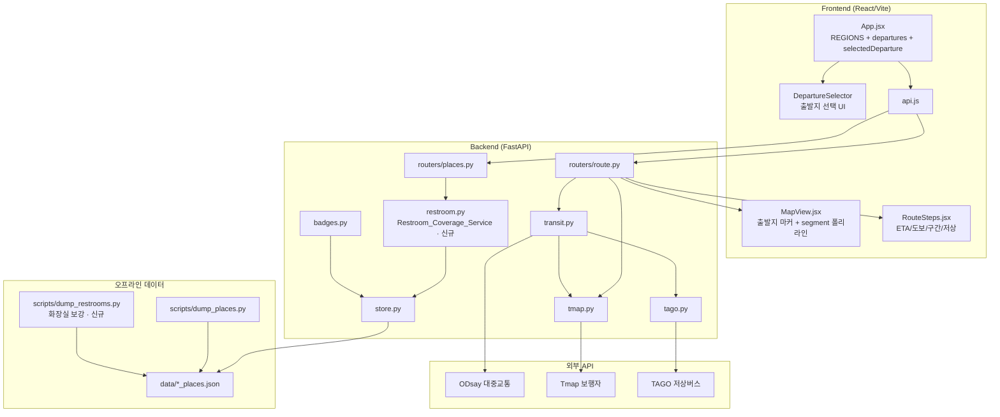
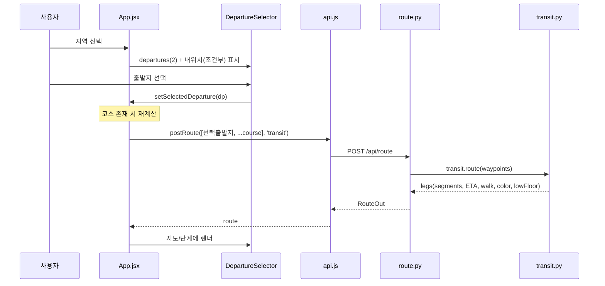

# Design Document

## Overview

이 설계는 "모두의 여행"(barrier-free-travel)의 기존 아키텍처(FastAPI 백엔드 + React/Vite 프론트엔드, TourAPI/Tmap/ODsay/TAGO 연동) 위에 세 가지 기능을 얹는다.

1. **지역별 고정 출발지(Departure Registry)**: 각 지역이 가진 단일 하드코딩 출발지(`origin`)를 지역당 2개(10개 지역 × 2 = 20개)로 확장하고, 코스 생성 전에 사용자가 명시적으로 출발지를 고르는 UX를 추가한다.
2. **출발지 기준 대중교통 경로**: 선택한 출발지를 경로의 첫 경유지로 삼아 기존 `transit.py`를 재사용하고, 실제 버스/지하철 폴리라인·소요시간·도보 구간이 지도와 단계 안내에 신뢰성 있게 렌더되도록 완성한다.
3. **장애인 화장실 커버리지**: 코스에 포함된 각 장소 주변 500m 이내의 접근 가능한 화장실을 안내하는 백엔드 서비스를 추가하고, 화장실 데이터가 부족한 지역을 외부 공공데이터로 보강한다.

### 설계 원칙

- **하위 호환 우선**: `schemas.py` 헤더가 "T+0 확정, 이후 변경 금지"라고 명시한다. 따라서 기존 필드는 절대 변경/삭제하지 않고, 신규 필드는 기본값을 가진 **선택적(additive)** 필드로만 추가한다. 기존 클라이언트가 신규 필드를 무시해도 동작해야 한다.
- **보수적 판정 유지**: 접근성 판정(계단 가능성, 저상버스, 화장실 배지)은 확인 불가한 경우 항상 "위험한 쪽"으로 판정한다(기존 `badges.py`, `tmap.py` 기조 계승).
- **앱은 안 죽는다**: 모든 외부 호출(Tmap/ODsay/TAGO/공공데이터)은 실패 시 폴백 또는 조용한 생략으로 처리하고 응답을 막지 않는다.
- **해커톤 실용성**: 20개 출발지는 코드 상수(프론트 REGIONS)로 관리하고, 화장실 보강은 오프라인 덤프 스크립트에서 처리해 런타임 외부 의존을 늘리지 않는다.

### 참조하는 기존 파일

| 영역 | 파일 |
|------|------|
| 출발지 정의·선택 | `frontend/src/App.jsx` (REGIONS, getOrigin, switchRegion, routeCourse) |
| 지도 렌더 | `frontend/src/MapView.jsx` (origin 마커, route 폴리라인) |
| 단계 안내 | `frontend/src/RouteSteps.jsx` |
| API 클라이언트 | `frontend/src/api.js` |
| 대중교통 경로 | `backend/app/services/transit.py` |
| 도보 경로 | `backend/app/services/tmap.py` |
| 저상버스 실시간 | `backend/app/services/tago.py` |
| 장소 저장소 | `backend/app/services/store.py` |
| 배지 판정 | `backend/app/services/badges.py` |
| 경로 라우터 | `backend/app/routers/route.py` |
| 장소 라우터 | `backend/app/routers/places.py` |
| API 계약 | `backend/app/schemas.py` |
| 데이터 덤프 | `backend/scripts/dump_places.py` |

## Architecture

### 전체 구성



### 변경 요약

| 컴포넌트 | 변경 유형 | 내용 |
|----------|-----------|------|
| `App.jsx` REGIONS | 수정 | 각 지역 `origin`(단일) → `departures`(2개 배열)로 확장. 기존 `origin`은 하위호환용으로 `departures[0]` 유지 가능 |
| DepartureSelector | 신규 | 출발지 2개 + (조건부)내 위치 중 택1 UI |
| `App.jsx` 상태 | 수정 | `selectedDeparture` 추가, region 변경 시 clear, 변경 시 재계산 |
| `restroom.py` | 신규 | 코스 장소별 최근접 화장실 탐색 서비스 |
| `routers/places.py` | 수정(additive) | `POST /api/restrooms/coverage` 엔드포인트 추가 |
| `schemas.py` | 수정(additive) | `RestroomCoverageRequest/Out` 신규 모델 추가 (기존 모델 불변) |
| `scripts/dump_restrooms.py` | 신규 | 공공데이터 장애인 화장실로 지역 공백 보강 |
| `store.py` | 최소 수정 | 보강 화장실 레코드를 PLACES에 병합 로드 (파일 규약만 확장) |
| `MapView.jsx` | 수정 | 출발지 마커 스타일 구분, 화장실 마커 렌더 (기존 로직 대부분 재사용) |
| `RouteSteps.jsx` | 수정 | segment별 ETA/도보/정거장/저상 표시 강화 |

경로 계산 자체(`transit.py`, `tmap.py`)는 이미 요구사항 대부분을 충족하므로 **로직 변경을 최소화**하고, 주로 프론트가 선택 출발지를 첫 waypoint로 보내도록 배선하는 데 집중한다.

### 데이터 흐름: 출발지 기준 대중교통 경로



## Components and Interfaces

### 1. Departure Registry (프론트엔드 상수)

**위치 결정**: 출발지는 **프론트엔드 `App.jsx`의 REGIONS 상수**에 저장한다. 근거:
- 기존 `origin`이 이미 REGIONS에 하드코딩되어 있어 자연스러운 확장이다.
- 20개 고정 지점은 런타임에 변하지 않는 상수이므로 백엔드 왕복이 불필요하다.
- 백엔드 `schemas.py`는 변경 금지 대상이라 신규 백엔드 스키마를 최소화하는 것이 안전하다.
- bbox·center가 이미 프론트 REGIONS에 있어 검증(경계 포함 여부)을 같은 위치에서 수행할 수 있다.

각 REGION 항목의 `origin`(단일 객체)을 `departures`(정확히 2개 원소 배열)로 확장한다. 기존 `getOrigin` 호출부 호환을 위해 `origin`은 `departures[0]`을 가리키도록 유지한다.

**검증 유틸(`validateDeparture`)**: REGIONS 로드 시 각 출발지가 다음을 만족하는지 검사하고, 불합격 지점은 선택 목록에서 제외하고 `console.warn`으로 제외 사유를 기록한다(Req 1.6).
- 이름 길이 1~60자
- 위도 -90~90, 경도 -180~180 (숫자형)
- 위도가 지역 bbox의 `[minLat, maxLat]` 범위 내, 경도가 `[minLng, maxLng]` 범위 내

### 2. DepartureSelector (신규 프론트 컴포넌트)

`ChatPanel`과 `RouteSteps` 사이(사이드바)에 렌더된다. 인터페이스:

```jsx
<DepartureSelector
  region={region}                    // 현재 지역 (departures 보유)
  selected={selectedDeparture}       // 선택된 출발지 | null
  myLoc={myLoc}                      // 내 위치 | null
  onSelect={(dp) => setSelectedDeparture(dp)}
/>
```

동작:
- 지역의 유효 `departures` 2개를 각각 **이름 + 유형(지하철역/버스터미널/주차장)** 라벨과 함께 선택 버튼으로 표시(Req 2.1, 2.3).
- `myLoc`이 존재하고 현재 지역 bbox 안이면 "내 위치" 옵션을 추가로 표시(Req 2.5). bbox 밖이거나 권한 거부 시 고정 2개만 표시(Req 2.6).
- 선택 시 `onSelect`로 App에 전달하고, App은 이를 경로 첫 waypoint의 origin으로 사용(Req 2.2).
- 선택 전에는 대중교통 경로 계산 버튼을 비활성화하고 "출발지를 먼저 선택해주세요" 안내를 표시(Req 2.4).

### 3. App.jsx 상태·플로우 변경

**신규 상태**: `selectedDeparture`(객체 | null).

**getOrigin 대체**: 기존 `getOrigin(r)`(내위치 우선, 없으면 r.origin)을 `selectedDeparture` 우선 로직으로 교체한다.
- 경로 계산 시 origin = `selectedDeparture` (필수). 미선택이면 대중교통 경로를 시작하지 않는다(Req 2.4, 3.8).

**region 변경(`switchRegion`)**: 기존 초기화(course/route/routeCourse)에 더해 `setSelectedDeparture(null)`을 추가하고 새 지역의 출발지 선택을 요청(Req 2.7).

**출발지 변경 시 재계산**: 코스가 이미 존재하는 상태에서 `selectedDeparture`가 바뀌면, `routeCourse`의 첫 원소(`__origin`)를 새 출발지로 교체하고 `loadRoute`를 다시 호출(Req 2.8). `useEffect([selectedDeparture])`로 처리.

**모드 토글(`switchMode`)**: 기존 로직 유지. 재계산 중 버튼 비활성화(`disabled={loading}`)는 이미 구현됨(Req 6.3). 실패 시 이전 경로 유지 — 현재 `catch`가 메시지만 추가하고 `setRoute`를 건드리지 않으므로 이미 만족(Req 6.4). 확인 후 유지.

### 4. Route Service (백엔드, 대부분 재사용)

`POST /api/route`(기존)는 이미 `mode=transit`일 때 `transit.route(waypoints)`를 호출한다. 프론트가 `waypoints[0]`을 선택 출발지로 보내면 Req 3.1(첫 경유지 = 출발지)이 충족된다.

**입력 검증 추가(Req 3.8)**: `route.py`에서 `mode=transit`인데 waypoints가 2개 미만(출발지만 있고 코스 장소 0개)이거나 출발지 정보가 비면 400 에러를 반환하고 segment 목록을 반환하지 않는다. `RouteRequest.waypoints`가 이미 `min_length=2`라 Pydantic이 1차 방어하지만, "출발지 + 코스 최소 1개"를 명시적으로 확인한다.

`transit.py`가 이미 충족하는 요구사항(로직 변경 불필요, 확인만):
- Req 3.2: 각 leg를 walk/bus/subway segment로 분해 — `_leg`에서 구현됨.
- Req 3.3/3.4: 700m 이하 도보 전용, 초과 시 대중교통 — `route()`의 `WALK_ONLY_M` 분기.
- Req 3.5: 환승 최소 → 총도보 최소 → 총시간 순 선택 — `_pick_path`의 정렬 키.
- Req 3.6: 지하철 포함 시 난이도 최소 "중간" — `_leg`의 worst 보정.
- Req 3.7: ODsay 키 없음/실패 시 도보 폴백 + 안내 — `_leg`/`_odsay`.
- Req 3.9: segment별 name/distance/duration/stations(도보는 빈 리스트) — segment dict 구성.
- Req 4.1: totalDuration = segment duration 합 — `route()` 반환.
- Req 4.2: totalDistance = walk segment distance 합 — `route()`의 `total_walk`.
- Req 9.2: 저상버스 실시간 실패 시 무시하고 경로 반환 — `tago.next_bus`가 `(None, "")` 반환, `_enrich_low_floor`가 조용히 생략.

**신뢰성 보강(Req 9.1)**: 전체 경로 응답이 10초 타임아웃 내 반환되도록 한다. 개별 외부 호출은 이미 타임아웃이 설정됨(Tmap 5s, ODsay 7s, TAGO 8s×재시도). 다구간 코스에서 누적 시간이 10초를 넘지 않도록 `transit.route`의 leg 계산은 캐시(`_cache`)를 활용하고, 저상버스 enrich는 leg별 순차 호출이므로 구간 수가 많으면 지연될 수 있다 → enrich 단계에 전체 예산(budget) 가드를 두어 초과 시 남은 구간은 `lowFloor=None`으로 건너뛴다.

### 5. MapView (수정)

- **출발지 마커(Req 5.6)**: 기존 `origin` prop 렌더 로직(`pinIcon('출', '#334155')`)을 유지하되, course 핀과 확실히 구분되도록 별도 스타일(짙은 색 + '출' 라벨)로 유지한다. `origin` prop을 `selectedDeparture`로 연결.
- **segment 폴리라인(Req 5.1~5.5)**: 기존 `route.legs.forEach`가 이미 segment별로 walk(점선+난이도색)/subway(노선색)/bus(녹색)를 그린다. `coords.length < 2`면 스킵하는 가드도 이미 있음(Req 5.5). subway/bus 색은 백엔드 `seg.color` 사용(Req 5.2, 5.3). walk는 `strokeStyle: 'dash'`(Req 5.4).
- **모드 전환 시 재렌더(Req 5.7)**: `route` prop 변경 시 `clear('route')` 후 재그리기 — 이미 구현됨.
- **화장실 마커(Req 6.6/7.6, 신규)**: 화장실 커버리지 결과의 좌표에 화장실 아이콘 마커를 추가하는 오버레이 그룹(`restrooms`)을 신설한다.

### 6. RouteSteps (수정)

기존 leg별 표시를 segment 단위로 강화한다.
- leg마다 ETA(분, 반올림, 최소 1분)와 도보 거리(m) 표시 — 기존 `fmtT`/`fmt` 재사용(Req 4.3, 4.7).
- transit segment마다 노선명·승차역·하차역·정거장 수(비음수 정수) 표시(Req 4.4). segment의 `stations` 길이 또는 ODsay `stationCount` 기반. 현재 `guides` 문자열에 포함되어 있으나, segment 구조에서 직접 렌더하도록 보강.
- bus segment의 `lowFloor`가 `true`/`false`면 저상 여부 표시, `null`이면 "저상버스 정보 없음" 표시(Req 4.5, 4.6).
- 화장실 커버리지 표시(Req 7.4/7.5): 각 코스 장소별 "가장 가까운 접근 화장실: {이름} ({거리}m)" 또는 "주변 인증 화장실 없음" 안내.

### 7. Restroom Coverage Service (신규 백엔드)

신규 파일 `backend/app/services/restroom.py`. 순수 함수 계층으로 구현해 property 테스트가 쉽도록 한다.

```python
# restroom.py
COVERAGE_RADIUS_M = 500

def _haversine_m(lat1, lng1, lat2, lng2) -> float: ...

def nearest_restroom(place: dict, candidates: list[dict]) -> dict | None:
    """place 주변 500m 내 toilet 배지 장소 중 최근접(동률이면 이름 사전순 첫번째)."""

def coverage_for_course(course_places: list[dict], all_places: list[dict]) -> list[dict]:
    """각 코스 장소별 화장실 커버리지 결과 리스트 반환."""
```

로직:
- 코스 장소가 toilet 배지를 가지면 자기 자신을 거리 0m로 반환(Req 7.2).
- 아니면 후보(전체 장소 중 toilet 배지 보유) 중 500m 이내 최근접을 선택, 거리 동률이면 이름 사전순 첫 번째(Req 7.3).
- 없으면 `restroom: null`(notice 렌더 트리거, Req 7.5).
- 결과에 이름, 거리(10m 단위 반올림), 위도, 경도 포함(Req 7.4, 7.6).

**엔드포인트**: `POST /api/restrooms/coverage` (신규, `routers/places.py`에 추가). 요청: 코스 장소 좌표/배지 목록 또는 contentId 목록. 응답: 장소별 커버리지 배열. 기존 엔드포인트 불변이므로 하위 호환.

### 8. 화장실 데이터 보강 (오프라인 스크립트)

신규 스크립트 `backend/scripts/dump_restrooms.py`:
- 외부 공공데이터(장애인 화장실 데이터셋, 예: data.go.kr 장애인용 화장실 정보)에서 지역별 레코드를 조회.
- 각 지역의 `data/{region}_places.json`에 toilet 배지를 가진 장소 수가 3개 미만이면 부족분을 보강(최소 3개까지 또는 소스 소진 시까지, Req 8.3).
- 보강 레코드는 name/lat/lng/region을 저장하며, 화장실 전용 최소 스키마를 `type` 특수값 또는 별도 필드로 표시하고 `badges: ["toilet"]`을 부여(Req 8.4).
- name/lat/lng 중 하나라도 없으면 제외하고 로그 기록(Req 8.5).
- 소스 불가 시 기존 레코드 유지, 로드 차단 없음(Req 8.6) — 스크립트는 오프라인 실행이므로 런타임 로드에 영향 없음.
- 각 지역이 toilet 배지 장소 ≥1을 갖도록 보장(Req 8.1).

`badges.py`의 `parse_badges`는 이미 보수적 판정(부정 키워드 있으면 탈락, 긍정 키워드 필요)을 구현하므로 Req 8.2/9.4를 충족한다. 확인만.

## Data Models

### Departure_Point (프론트 REGIONS 내부 구조)

```js
// App.jsx REGIONS 각 항목의 departures 원소
{
  name: '광화문역',        // 1~60자
  lat: 37.5717,            // -90 ~ 90, 지역 bbox 내
  lng: 126.9769,           // -180 ~ 180, 지역 bbox 내
  type: '지하철역',        // '지하철역' | '버스터미널' | '주차장'
}
```

지역 항목 예시(서울):

```js
{ id: 'seoul', name: '서울 · 경복궁 일대', ready: true,
  center: { lat: 37.5788, lng: 126.977 }, bbox: [37.4, 37.7, 126.8, 127.2],
  departures: [
    { name: '광화문역', lat: 37.5717, lng: 126.9769, type: '지하철역' },
    { name: '서울역', lat: 37.5547, lng: 126.9706, type: '지하철역' },
  ],
  get origin() { return this.departures[0] },  // 하위호환
  keywords: [...] }
```

지역별 출발지 유형 배정(Req 1.5: 지하철 있는 지역은 ≥1 지하철역):

| 지역 | 출발지 1 | 출발지 2 |
|------|----------|----------|
| 서울 | 광화문역(지하철역) | 서울역(지하철역) |
| 부산 | 해운대역(지하철역) | 부산역(지하철역) |
| 대구 | 반월당역(지하철역) | 동대구역(지하철역) |
| 인천 | 인천역(지하철역) | 인천종합버스터미널(버스터미널) |
| 경주 | 경주시외버스터미널(버스터미널) | 대릉원 공영주차장(주차장) |
| 전주 | 전주고속버스터미널(버스터미널) | 한옥마을 공영주차장(주차장) |
| 강릉 | 강릉역(지하철역/KTX) | 강릉시외버스터미널(버스터미널) |
| 여수 | 여수엑스포역(지하철역/KTX) | 여수종합버스터미널(버스터미널) |
| 제주 | 제주버스터미널(버스터미널) | 제주국제공항 주차장(주차장) |
| 수원 | 수원역(지하철역) | 화성행궁 공영주차장(주차장) |

(지하철 미운행 지역인 경주·전주·제주는 지하철역 유형을 배정하지 않아 Req 1.5를 위배하지 않는다. KTX역은 도시철도가 아니지만 광역철도 접근점으로 '지하철역' 유형 대신 실제 운영 형태에 맞춰 배정하며, 최종 좌표·유형은 구현 시 검증한다.)

### RouteLeg / TransitSegment (기존, 변경 없음)

`schemas.py`의 `RouteLeg`, `TransitSegment`, `RouteOut`는 이미 필요한 모든 필드(`segments`, `distance`(도보), `duration`(전체), `color`, `lowFloor`, `lowFloorNote`, `stations`)를 보유한다. **변경하지 않는다.**

### RestroomCoverage (신규, additive 스키마)

`schemas.py`에 신규 모델만 추가한다(기존 모델 불변, "변경 금지" 준수):

```python
class RestroomCoveragePlace(BaseModel):
    contentId: str = ""
    lat: float
    lng: float
    badges: list[str] = []
    title: str = ""

class RestroomCoverageRequest(BaseModel):
    places: list[RestroomCoveragePlace] = Field(min_length=1)

class RestroomInfo(BaseModel):
    name: str
    lat: float
    lng: float
    distance: int          # m, 10m 단위 반올림. 자기 자신이면 0
    isSelf: bool = False

class RestroomCoverageItem(BaseModel):
    contentId: str = ""
    restroom: RestroomInfo | None = None   # None = 500m 내 없음 (notice)

class RestroomCoverageOut(BaseModel):
    items: list[RestroomCoverageItem]
```

### 보강 화장실 레코드 (data/*_places.json 확장)

보강 화장실은 기존 place 스키마의 최소 부분집합으로 저장해 `store.py`가 그대로 로드한다:

```json
{
  "contentId": "restroom_seoul_0001",
  "title": "경복궁 장애인 화장실",
  "type": 99,
  "lat": 37.5796, "lng": 126.9770,
  "addr": "", "image": "", "overview": "", "tel": "",
  "badges": ["toilet"],
  "accessibilityRaw": {"화장실": "장애인 화장실 있음(공공데이터 보강)"}
}
```

`type: 99`는 "보강 화장실"을 뜻하는 신규 특수값으로, 기존 관광지(12)·음식점(39) 쿼리에 섞이지 않는다. `store.query`는 `type_` 필터가 있으므로 화장실은 별도 조회되며 지도의 관광지/음식점 마커에는 나타나지 않는다.

## Correctness Properties

*A property is a characteristic or behavior that should hold true across all valid executions of a system-essentially, a formal statement about what the system should do. Properties serve as the bridge between human-readable specifications and machine-verifiable correctness guarantees.*

다음 속성들은 위의 사전 분석(prework)에서 테스트 가능하다고 판정된 인수 기준을 보편 정량화 문장으로 옮긴 것이다. UI 렌더링·인프라·단순 예시 성격의 기준은 속성이 아니라 예시/통합 테스트로 다룬다(테스트 전략 참조). 중복 속성은 통합했다.

### Property 1: 출발지 레지스트리 유효성

*For any* 지원 지역, 그 지역의 유효 출발지 목록은 정확히 2개의 원소를 가지며(전체 10개 지역 합계 20개), 각 출발지는 이름 길이 1~60자, 위도 -90~90, 경도 -180~180 범위를 만족하고, 유형이 {지하철역, 버스터미널, 주차장} 집합에 속하며, 위경도가 해당 지역 bbox 내부에 있다.

**Validates: Requirements 1.1, 1.2, 1.3, 1.4**

### Property 2: 잘못된 출발지는 선택 목록에서 제외된다

*For any* 이름 누락·좌표 비숫자·범위 초과·bbox 외부 중 하나 이상에 해당하는 출발지 정의에 대해, 그 출발지는 선택 가능한 목록에서 제외되고 제외 사유가 기록된다.

**Validates: Requirements 1.6**

### Property 3: 선택한 출발지가 경로의 시작점이 된다

*For any* 선택된 출발지와 1개 이상의 코스 장소로 이루어진 코스에 대해, 경로 계산에 사용되는 경유지 목록의 첫 번째 원소는 선택된 출발지 좌표와 일치한다.

**Validates: Requirements 2.2, 3.1**

### Property 4: 지역 변경 시 선택 출발지 초기화

*For any* 지역 전환에 대해, 전환 직후 선택된 출발지 상태는 비어 있다(새 선택 요청 상태).

**Validates: Requirements 2.7**

### Property 5: 내 위치 옵션 노출 조건

*For any* 기기 위치에 대해, 출발지 선택 옵션 개수는 그 위치가 활성 지역 bbox 내부에 있을 때에만 3개(고정 2개 + 내 위치)이고, 그 외(권한 거부 또는 bbox 외부)에는 정확히 2개이다.

**Validates: Requirements 2.5, 2.6**

### Property 6: 대중교통 leg는 유효한 segment로 분해된다

*For any* 대중교통 경로에 대해, 모든 Route_Segment는 {walk, bus, subway} 중 정확히 하나의 유형을 가지며, 각 segment는 name·distance·duration·stations를 포함하고, walk segment의 stations는 빈 리스트이다.

**Validates: Requirements 3.2, 3.9**

### Property 7: 700m 임계로 도보 전용/대중교통 포함이 결정된다

*For any* 연속한 두 경유지에 대해, 직선거리가 700m 이하이면 그 사이 leg는 도보 전용(대중교통 segment 없음)이고, 700m를 초과하고 대중교통 경로가 존재하면 그 leg는 최소 1개의 bus 또는 subway segment를 포함한다.

**Validates: Requirements 3.3, 3.4**

### Property 8: 경로 선택은 환승·도보·시간 순 최소를 고른다

*For any* 후보 대중교통 경로 목록에 대해, 선택된 경로의 (환승 수, 총 도보 거리, 총 소요시간) 튜플은 모든 다른 후보의 튜플보다 사전식으로 작거나 같다.

**Validates: Requirements 3.5**

### Property 9: 지하철 포함 leg의 난이도는 최소 중간

*For any* 지하철 segment를 포함하는 leg에 대해, 그 leg의 난이도 순위는 "중간" 이상(중간 또는 어려움)이다.

**Validates: Requirements 3.6**

### Property 10: ODsay 불가 시 도보 폴백

*For any* 대중교통 경로 요청에 대해, ODsay API 키가 없거나 호출이 실패하면 결과 leg는 도보 경로이고 대중교통 대신 도보 경로가 제공된다는 안내를 포함한다.

**Validates: Requirements 3.7**

### Property 11: 잘못된 대중교통 입력은 거부된다

*For any* 선택 출발지가 없거나 코스 장소가 0개인 대중교통 경로 요청에 대해, 시스템은 요청을 거부하고 누락 입력을 설명하는 에러를 반환하며 Route_Segment 목록을 반환하지 않는다.

**Validates: Requirements 3.8**

### Property 12: 전체 소요시간은 segment 소요시간의 합

*For any* 대중교통 경로에 대해, 전체 ETA(초)는 모든 Route_Segment duration(초)의 합과 같다.

**Validates: Requirements 4.1**

### Property 13: 전체 도보 거리는 walk segment 거리의 합

*For any* 대중교통 경로에 대해, 전체 도보 거리(m)는 모든 walk Route_Segment distance(m)의 합과 같다.

**Validates: Requirements 4.2**

### Property 14: ETA 분 표시 규칙

*For any* 비음수 소요시간(초)에 대해, 표시되는 분 값은 max(1, round(초/60))과 같다(반올림, 최소 1분).

**Validates: Requirements 4.7**

### Property 15: 정거장 수는 비음수 정수

*For any* transit Route_Segment에 대해, 표시되는 정거장 수는 0 이상의 정수이다.

**Validates: Requirements 4.4**

### Property 16: 지하철 노선색 매핑

*For any* 지하철 노선명에 대해, 색상 매핑은 등록된 노선 접두어와 일치하면 해당 노선색을, 일치하지 않으면 기본 색상을 반환한다.

**Validates: Requirements 5.2**

### Property 17: 빈 좌표 segment는 렌더에서 건너뛴다

*For any* segment 목록에 대해, 좌표가 빈(2점 미만) segment는 폴리라인이 그려지지 않고, 그려진 폴리라인 수는 좌표가 있는 segment 수와 같다(나머지 segment 렌더는 계속된다).

**Validates: Requirements 5.5**

### Property 18: toilet 배지 장소는 자기 자신이 화장실 출처

*For any* toilet 배지를 가진 코스 장소에 대해, 화장실 커버리지 결과는 그 장소 자신을 거리 0m의 접근 화장실 출처로 보고한다(isSelf 참).

**Validates: Requirements 7.2**

### Property 19: 최근접 화장실 선택

*For any* toilet 배지가 없는 코스 장소와 후보 화장실 집합에 대해, 커버리지는 500m 이내 후보 중 직선거리가 최소인 화장실(거리 동률이면 이름 사전순 첫 번째)을 선택해 그 이름·10m 단위로 반올림한 거리·위경도를 함께 반환하고, 500m 이내 후보가 없으면 화장실 없음(notice)을 반환한다.

**Validates: Requirements 7.1, 7.3, 7.4, 7.5, 7.6**

### Property 20: 지역별 화장실 최소 보장

*For any* 지원 지역에 대해, Place_Store 내 toilet 배지를 가진 장소 수는 1개 이상이다.

**Validates: Requirements 8.1**

### Property 21: 보수적 화장실 배지 판정

*For any* 화장실 서술 필드 문자열에 대해, toilet 배지는 그 문자열이 긍정 지표를 1개 이상 포함하고 부정 지표를 0개 포함할 때에만 부여된다(부정 지표가 하나라도 있으면 배지 생략).

**Validates: Requirements 8.2, 9.4**

### Property 22: 화장실 데이터 보강 규칙

*For any* 초기 화장실 레코드 n개(<3)를 가진 지역과 외부 소스의 m개 후보에 대해, 보강 후 그 지역의 화장실 레코드 수는 감소하지 않으며 min(목표 3개, n+m)에 도달한다. 이때 name·lat·lng 중 하나라도 누락된 후보 레코드는 제외되고 제외 사유가 기록되며, 저장된 각 레코드는 name·lat·lng·region을 갖는다.

**Validates: Requirements 8.3, 8.4, 8.5**

### Property 23: 저상버스 실시간 실패는 경로를 막지 않는다

*For any* 대중교통 경로에 대해, 저상버스 실시간 조회가 실패하면(정보 없음) 경로는 정상 반환되고 버스 segment의 저상 여부는 미확정(None)으로 표시되며 예외가 발생하지 않는다.

**Validates: Requirements 9.2**

## Error Handling

설계 전반에서 "앱은 안 죽는다"는 기존 기조를 유지한다.

| 실패 지점 | 처리 | 근거 요구사항 |
|-----------|------|---------------|
| 출발지 정의 불량(이름/좌표/bbox) | 선택 목록에서 제외 + `console.warn` 로그 | 1.6 |
| 대중교통 미선택 출발지 | 대중교통 계산 차단, 프롬프트 표시 | 2.4, 3.8 |
| 대중교통 요청 waypoints<2 | `route.py`에서 400 에러, segment 미반환 | 3.8 |
| ODsay 키 없음/호출 실패 | `transit._leg` 도보 폴백 + 안내 문구 | 3.7, 9.1 |
| Tmap 보행자 호출 실패 | `tmap._leg` searchOption 30→0 재시도 → 직선 폴백(fallback=True, 난이도 어려움) | 9.1 |
| TAGO 저상 조회 실패/미신청/타임아웃 | `tago.next_bus`가 `(None, "")` 반환, `_enrich_low_floor` 조용히 생략, lowFloor=None | 9.2 |
| 다구간 enrich 지연(10s 예산 초과 위험) | 남은 버스 구간 enrich 생략(lowFloor=None) | 9.1, 9.2 |
| 두 경유지 경로 완전 실패 | 직선 폴백 + 실패 구간 식별 메시지 표시 | 9.3 |
| 모드 전환 재계산 실패 | 에러 메시지 표시, `setRoute` 미변경으로 이전 경로 유지 | 6.4 |
| 화장실 500m 내 없음 | `restroom: null` 반환 → notice 렌더 | 7.5 |
| 화장실 보강 레코드 필드 누락 | 스크립트에서 제외 + 로그 | 8.5 |
| 외부 화장실 소스 불가 | 기존 레코드 유지, 오프라인 스크립트라 런타임 로드 무영향 | 8.6 |
| segment 빈 좌표 | 폴리라인 스킵, 나머지 렌더 계속 | 5.5 |

**타임아웃 예산(Req 9.1)**: 단일 경로 응답은 10초 이내 반환을 목표로 한다. 개별 호출 타임아웃(Tmap 5s, ODsay 7s, TAGO 8s)이 이미 있고, `_cache`가 반복 구간을 흡수한다. 다구간 코스에서 저상 enrich가 누적 지연을 유발할 수 있으므로 enrich 루프에 경과 시간 가드를 추가해 예산 초과 시 남은 구간을 건너뛴다(경로 자체는 항상 반환).

## Testing Strategy

### 이중 접근

- **단위/예시 테스트**: 구체 예시, UI 렌더링, 엣지 케이스, 통합 지점.
- **속성 기반 테스트(PBT)**: 위 Correctness Properties의 보편 속성. 순수 로직 계층(경로 파싱/선택, 화장실 커버리지, 배지 판정, 포맷터, 출발지 검증)에 적용.

### PBT 적용 범위

이 기능의 상당 부분은 순수 함수 또는 명확한 입출력 로직이라 PBT가 적합하다:
- 백엔드: `transit._pick_path`(경로 선택), segment 분해 로직, `transit.route`의 700m 분기 및 합계, `restroom.py`(커버리지), `badges.parse_badges`, `_subway_color`.
- 프론트: 출발지 검증 유틸, `fmtT`/거리 반올림 포맷터, 옵션 개수 로직, 폴리라인 렌더 카운트(순수 계산 분리).

**PBT 비적용(예시/통합 테스트로 대체)**:
- Tmap 지도 마커/폴리라인 실제 렌더(5.1, 5.3, 5.4, 5.6, 5.7): 컴포넌트/스냅샷·모의(mock) 테스트.
- DepartureSelector·모드 토글 UI 표시(2.1, 2.3, 4.3, 4.5, 4.6, 6.1, 6.2, 6.3): 컴포넌트 렌더 테스트.
- 실패 시 10초 타임아웃·폴백(9.1), 실패 구간 메시지(9.3), 외부 소스 불가(8.6): 1~3개 예시의 통합/모의 테스트.
- 지하철 운행 지역의 지하철역 유형 배정(1.5): 예시 테스트.

### 속성 테스트 구성 규칙

- 라이브러리: 백엔드 Python은 **Hypothesis**, 프론트 JS는 **fast-check** 사용. 직접 구현하지 않는다.
- 각 속성 테스트는 최소 **100회** 반복.
- 각 테스트에 대응 설계 속성을 주석으로 태깅한다.
- 태그 형식: `Feature: departure-transit-accessibility, Property {번호}: {속성 텍스트}`
- 각 Correctness Property는 **단일** 속성 기반 테스트로 구현한다.

### 외부 의존 처리

- ODsay/Tmap/TAGO 응답은 대표 픽스처와 생성기(generator)로 모의한다. 실제 네트워크 호출 없이 파싱·선택·폴백 로직을 검증한다.
- 통합 테스트는 실제 API 키가 있을 때만 1~3개 대표 경로로 스모크 수준 확인(경로 렌더, 폴백 동작).

### 예시 테스트 최소 집합

- 서울(경복궁) 출발지 선택 → 대중교통 경로 → segment 렌더 스모크.
- 저상버스 실시간 성공/실패/미신청 3케이스.
- 화장실 커버리지: 배지 보유 장소(자기 자신), 500m 내 존재, 500m 내 없음 3케이스.
- 지역 전환 시 선택 초기화 + 코스/경로 초기화.
