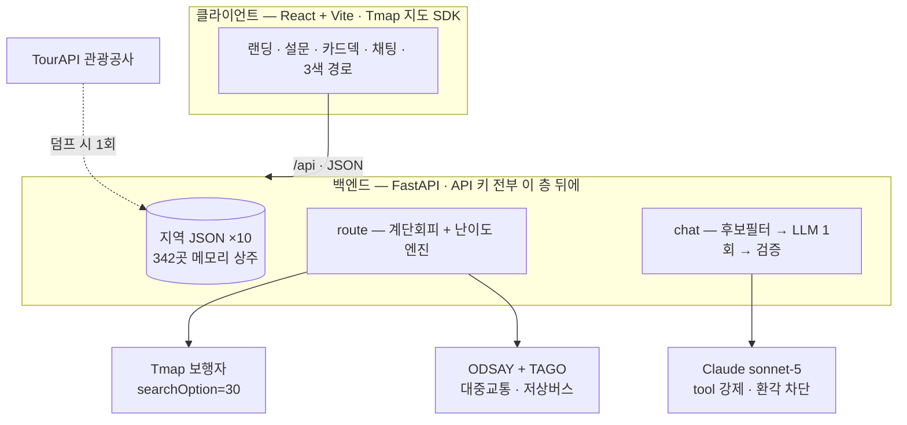

<div align="center">


# 편해질지도

**이동약자를 위한 무장애 여행 플래너**

*"여기 진짜 갈 수 있나?"를 없애는 지도*


휠체어 이용자 · 고령자 · 유모차 가족이 **계단 없는 길**로,
**접근성이 검증된 곳만** 골라 여행할 수 있게 돕습니다.

무박이일 해커톤 프로젝트 · **팀 삼박자**

</div>

---

## ✨ 무엇을 하는 앱인가

| | 기능 | 설명 |
|---|---|---|
| 🧩 | **페르소나 설문** | 이동약자 유형 · 필수 편의시설 · 일정 강도를 칩으로 30초 입력 |
| 🗂️ | **카테고리 카드덱** | 조건 100% 만족 장소만 — 여행지 → 식당 → 카페 순서로 담기/패스 |
| 💬 | **채팅 코스 추천** | "휠체어로 경주 반나절 코스 짜줘" 한 문장이면 지역 인식 → 코스 생성 |
| 🚶 | **계단 회피 경로** | 출발지(내 위치·역·터미널)부터 Tmap `searchOption=30` 도보 경로 |
| 🚌 | **대중교통 + 저상버스** | ODSAY 경로에 TAGO 실시간으로 **다음 버스가 저상인지**까지 표시 |
| 🚦 | **이동 난이도** | 구간별 쉬움·중간·어려움을 **지도 색(파랑·호박·빨강)** 과 사유로 병기 |
| 🚻 | **화장실 커버리지** | 코스 각 장소에서 가장 가까운 인증 화장실과 거리 |

## 🗺️ 지원 지역 — 전부 실데이터

"준비 중" 없음. 10개 지역 모두 한국관광공사 무장애 인증 데이터를 사전 덤프해 서빙합니다.

| 지역 | 장소 | 지역 | 장소 |
|---|---:|---|---:|
| 서울 · 경복궁 일대 | 104 | 부산 · 해운대 | 15 |
| 강릉 · 경포 | 94 | 제주 · 제주시 | 14 |
| 수원 · 화성 | 38 | 전주 · 한옥마을 | 12 |
| 대구 · 근대골목 | 21 | 여수 · 오동도 | 10 |
| 경주 · 대릉원 | 17 | 인천 · 개항장 | 16 |

## 🏗️ 아키텍처



시연 중 실시간 외부 의존은 **경로와 추천뿐** — 장소 데이터는 완전 로컬이라 발표장 네트워크가 죽어도 핀은 뜹니다.
상세: [ARCHITECTURE.md](./ARCHITECTURE.md)

## 🚦 이동 난이도 기준

경로에서 **가장 어려운 요소 하나**가 최종 난이도를 정합니다(worst-element).
확인 불가한 것(계단 칸수·경사 각도·육교의 승강설비)은 전부 위험한 쪽으로 — *"아마 되겠지"는 금지.*

| 등급 | 구간 기준 |
|---|---|
| 🔴 **어려움** | 계단 · 육교/지하보도 1회 이상 · 도보 **1.5km** 초과 · 경사로 3회 이상 |
| 🟡 **중간** | 경사로 1~2회 · 횡단보도 5회 이상 · 도보 **700m~1.5km** |
| 🔵 **쉬움** | 해당 없음 *(중간 요소 4개 이상이면 어려움으로 상향)* |

코스 전체가 도보 **4km**를 넘으면 반나절 권장 초과로 어려움 처리. 항상 사유를 병기합니다 — `어려움 · 계단 2회 · 도보 1,680m`

## 🚀 시작하기

```bash
git clone https://github.com/gkfla2020-bit/barrier-free-travel.git
```

**백엔드**

```bash
cd backend
cp .env.example .env        # 키 입력 — 팀 메신저 참조
python3 -m venv .venv && .venv/bin/pip install -r requirements.txt
.venv/bin/uvicorn app.main:app --host 0.0.0.0 --port 8000
```

**프론트엔드**

```bash
cd frontend
echo 'VITE_TMAP_APP_KEY=<Tmap appKey>' > .env.local
npm install && npm run dev   # http://localhost:5173
```

> `ODSAY_API_KEY`(대중교통 경로): [lab.odsay.com](https://lab.odsay.com) 가입 → 마이페이지 → 애플리케이션 등록(서버 유형) → 즉시 발급.
> 키가 없어도 앱은 동작하며, 대중교통 모드가 도보 경로로 폴백됩니다.

> ⚠️ `.env` / `.env.local`은 절대 커밋하지 않습니다 (.gitignore 등록됨).

**새 지역 추가** — 덤프 한 줄 + 프론트 지역 레지스트리 1항목이 전부:

```bash
.venv/bin/python scripts/dump_places.py --region gyeongju --lng 129.216 --lat 35.837 --radius 3000
```

## 🔌 API

| 엔드포인트 | 설명 |
|---|---|
| `GET /api/places` | bbox 안 무장애 장소 (배지·카테고리 포함) |
| `GET /api/places/{id}` | 개요 · 사진 · 접근성 원문 25필드 |
| `POST /api/route` | 도보/대중교통 경로 + 구간별 난이도·사유 |
| `POST /api/chat` | 채팅 코스 추천 (지역 인식) |
| `POST /api/restrooms/coverage` | 코스 장소별 최근접 인증 화장실 |

## 🧭 설계 원칙

1. **정직이 기능이다** — 잘못된 "접근 가능" 표시는 사고다. 애매하면 배지를 달지 않고 원문을 보여준다
2. **worst-element 난이도** — 좋은 요소 아홉이 나쁜 요소 하나를 못 덮는다
3. **폴백 5중** — TourAPI(덤프)·Tmap·ODSAY·TAGO·Claude, 어떤 것이 죽어도 데모는 산다
4. **LLM은 고르기만** — 장소 선택은 LLM, 숫자(거리·계단·시간)는 항상 실데이터

## 📁 문서

| 문서 | 내용 |
|---|---|
| [ARCHITECTURE.md](./ARCHITECTURE.md) | 상세 아키텍처 (해커톤 실행판) |
| [DEMO_SCENARIO.md](./DEMO_SCENARIO.md) | 시연 시나리오 |
| [PAINPOINTS.md](./PAINPOINTS.md) | 이동 페인포인트 6가지와 해결 |
| [PROJECT_STATUS.md](./PROJECT_STATUS.md) | 진행 현황 |

---

<div align="center">

**팀 삼박자** — 무박이일 해커톤 · 2026

*모두가 편해질 지도를 만듭니다.*

</div>
