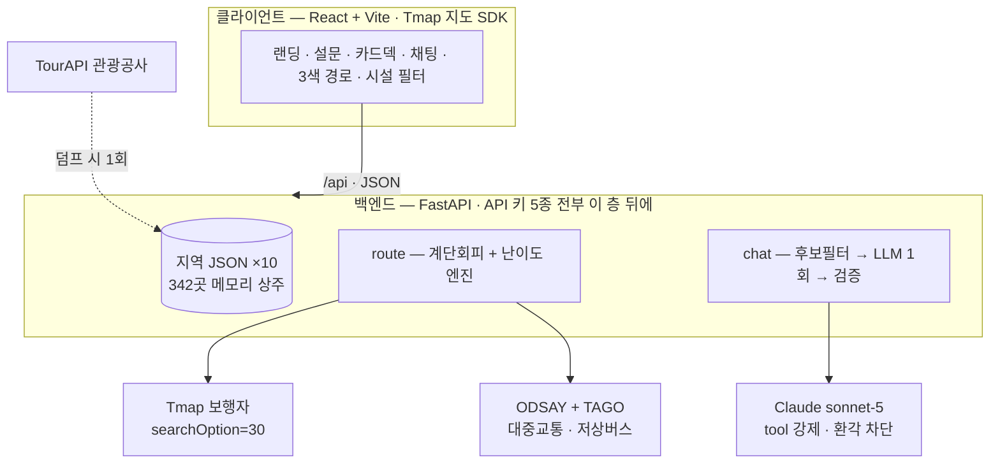

<div align="center">


# 편해질지도

**직접 설계하는 장벽 없는 여행**

*조금 돌아가더라도, 갈 수 없는 길이 없게*


TECH4GOOD 해커톤 · **팀 삼박자**

</div>

---

## 🧩 문제 — 이동약자의 여행은 "검증 노동"에서 끝난다

비이동약자의 여행 계획은 *"어디 가지?"* 에서 시작하지만, 휠체어 이용자·고령자·유모차 가족의 여행 계획은 **"거기 갈 수 있나?"** 에서 시작합니다.

- 관광지 페이지에 경사로·엘리베이터·장애인 화장실 정보가 **없거나 흩어져** 있고
- 지도 앱의 도보 경로는 **계단·육교를 아무렇지 않게 통과**시키며
- 블로그 후기는 *"입구까지 갔는데 계단이라 돌아왔다"* 로 끝납니다

전화 확인과 로드뷰 정찰을 반복하다, 많은 경우 **여행 자체를 포기**하게 됩니다.

## 💡 해결 — 검증 노동을 앱이 대신한다

> **정직이 기능이다.** 잘못된 "접근 가능" 표시는 버그가 아니라 사고다.

| | 일반 지도 앱 | **편해질지도** |
|---|---|---|
| 장소 정보 | 리뷰 · 별점 | 한국관광공사 **실사 접근성 25항목** + 원문 그대로 |
| 도보 경로 | 최단거리 (계단 포함) | **계단 회피 기본** + 잔여 계단은 숨기지 않고 경고 |
| 경로 난이도 | 없음 | 구간별 **쉬움·중간·어려움** + 사유 병기, 지도에 3색 표시 |
| 대중교통 | 노선 · 시간 | **다음 버스가 저상인지**까지 실시간 표시 |
| 코스 설계 | 사용자가 직접 | 조건 100% 만족 "안전지대"만 후보로 — 설문 30초 or 채팅 한 문장 |
| 정보가 없을 때 | 침묵 | **"확인 불가"라고 말함** — 애매하면 위험한 쪽으로 |

## 🚀 사용 흐름 — 30초 설문에서 3색 경로까지

```
[ 타이틀 ] → [ ① 이동 조건 ] → [ ② 후보 카드 ] → [ ③ 코스 + 경로 ]
 시작하기      칩 설문 30초      담기 / 패스       출발지부터 3색 경로
```

1. **조건 입력** — 이동약자 유형(전동/수동 휠체어·유모차·고령·목발) · 필수 편의시설 · 일정 강도를 칩으로. 지역은 목록이 아니라 **채팅으로** — "제주"라고 치면 지도가 제주로 이동합니다.
2. **안전지대 필터** — 조건을 100% 만족하는 장소만 후보로. '여유롭게' 모드면 후보가 **700m 안에 가장 많이 몰린 밀집 클러스터**를 자동으로 찾아 동선 자체를 짧게 설계합니다.
3. **카드 담기** — 실사진 · 접근성 배지 · 실사 원문(*"주출입구는 턱이 없어 휠체어 접근 가능함"*)이 그대로 보이는 카드를 **여행지 → 식당 → 카페** 순서로 담습니다.
4. **코스 완성** — 담은 곳을 최근접 순으로 정렬하고, **출발지(내 위치·역·터미널)부터** 계단 회피 경로를 그립니다. 경로 요약은 LLM이 아닌 실데이터로 생성됩니다 — *"총 도보 1.8km · 22분 · 중간 — 횡단보도 8회"*.

채팅으로 시작해도 같은 결과에 도달합니다. **"휠체어로 경주 반나절 코스 짜줘"** 한 문장 → 지역 인식 → 코스 → 경로.

## 🗺️ 지원 지역 — 10곳 전부 실데이터

"준비 중" 라벨은 없습니다. 전 지역을 한국관광공사 무장애 인증 데이터로 **사전 덤프**해 서빙합니다.

| 지역 | 장소 | 지역 | 장소 |
|---|---:|---|---:|
| 서울 · 경복궁 일대 | 104 | 인천 · 개항장 | 16 |
| 강릉 · 경포 | 94 | 부산 · 해운대 | 15 |
| 수원 · 화성 | 38 | 제주 · 제주시 | 14 |
| 대구 · 근대골목 | 21 | 전주 · 한옥마을 | 12 |
| 경주 · 대릉원 | 17 | 여수 · 오동도 | 10 |

관광지 143 · 음식점 155 · **카페 43** — 새 지역 추가는 덤프 명령 **한 줄**이면 됩니다(확장성).

## 🚦 이동 난이도 — 이 앱의 심장

경로에서 **가장 어려운 요소 하나**가 최종 난이도를 정합니다(worst-element). 저상버스가 아무리 편해도 계단이 하나 있으면 그 경로는 어려움입니다 — 이동약자의 실제 경험이 그렇기 때문입니다.

| 등급 | 구간 기준 | 지도 표시 |
|---|---|---|
| 🔴 **어려움** | 계단 · 육교/지하보도 1회+ · 도보 1.5km 초과 · 경사로 3회+ | 빨간 실선 |
| 🟡 **중간** | 경사로 1~2회 · 횡단보도 5회+ · 도보 700m~1.5km | 호박 실선 |
| 🔵 **쉬움** | 해당 없음 *(중간 요소 4개+면 상향)* | 파란 실선 |

- 코스 총 도보 **4km 초과 → 어려움** (반나절 권장 초과) · 계단 *가능성* 구간은 **점선**
- 등급만 던지지 않고 **사유 병기** — `어려움 · 계단 2회 · 도보 1,680m`
- 감지: Tmap turnType(계단·육교·지하보도·경사로·엘리베이터·횡단보도) + 구간 시설물 이중 감지
- 확인 불가한 것(계단 칸수 · 경사 각도 · 육교의 승강설비)은 **전부 위험한 쪽으로** 분류

## 🏗️ 아키텍처 — 발표장에서 죽지 않는 구조



**시연 중 실시간 외부 의존은 경로와 추천뿐입니다.** 장소 데이터는 완전 로컬 — 발표장 네트워크가 죽어도 핀과 접근성 정보는 뜹니다. 나머지도 전부 폴백이 있습니다:

| 의존 | 죽으면 | 데모 영향 |
|---|---|---|
| TourAPI | 덤프 이후 아예 안 씀 | 없음 |
| Tmap | 옵션 폴백 → 픽스처 → 직선+경고 | 무손실 |
| ODSAY/TAGO | 도보 폴백 · "저상 정보 없음" | 기능 축소로 생존 |
| Claude | 15초 타임아웃 → 픽스처 | 무손실 |
| 백엔드 | 프론트 전 호출 try-catch | 재시작 10초 |

**LLM 환각은 3중으로 차단합니다** — ① 서버가 후보를 16곳으로 압축해 전달 ② `tool_choice` 강제로 JSON 스키마 보장 ③ 후보 밖 contentId는 서버가 전량 폐기. 사용자에게 보이는 숫자(거리·계단·시간)는 항상 Tmap 실데이터에서 **코드가** 생성합니다.

## 🔧 기술적 도전과 해결 (전부 실화)

<details>
<summary><b>1. Tmap 지도가 태평양으로 날아가는 SDK 버그</b></summary>

`fitBounds`가 서울 좌표를 넣어도 (27°N, −180°E) 태평양으로 카메라를 보냈습니다. 라이브 디버깅으로 재현 조건을 잡고, **경로 좌표 min/max에서 중심·줌을 직접 계산**하는 방식으로 교체했습니다.
</details>

<details>
<summary><b>2. document.write 기반 지도 SDK와 키 보안의 양립</b></summary>

Tmap jsv2는 비동기 주입 시 로드가 통째로 무시됩니다. `index.html` 동기 로드 + **Vite HTML env 치환**으로, 공개 저장소에 키가 한 글자도 커밋되지 않으면서 SDK가 정상 로드되게 했습니다.
</details>

<details>
<summary><b>3. 문서에 없는 계단 신호 — facilityType=17 실측 발견</b></summary>

계단이 안내점(turnType) 없이 **구간 시설물 코드로만 오는 경로**를 실측으로 찾아냈습니다(명동→남산: 계단회피 옵션에서 해당 구간이 통째로 사라짐 = 계단 확정). 이중 감지로 난이도 판정 누락을 막았습니다.
</details>

<details>
<summary><b>4. "전부 어려움"으로 뜨던 코스 — 원인은 난이도가 아니라 후보 선정</b></summary>

조건 만족 장소가 시내 3km에 흩어져 있으면 뭘 골라도 구간이 깁니다. **반경 700m에 후보가 가장 많은 밀집 클러스터 앵커**를 찾아 후보를 제한하자 같은 시나리오가 3.6km 어려움 → **1.8km 쉬움~중간**으로 바뀌었습니다. 기준을 느슨하게 푸는 대신 동선을 짧게 설계하는 정공법입니다.
</details>

<details>
<summary><b>5. 서술형 접근성 데이터의 보수적 파싱</b></summary>

공공데이터의 접근성 필드는 *"대여가능(수동휠체어 2대)"* 같은 자유 서술형입니다. 긍정 키워드가 있고 부정 키워드가 없을 때만 배지를 달고, **애매하면 배지 없이 원문을 노출**합니다. 이 도메인에서 과잉 판정은 사용자를 현장에 고립시키는 사고이기 때문입니다.
</details>

## ⚡ 직접 실행해 보기

```bash
git clone https://github.com/gkfla2020-bit/barrier-free-travel.git

# 백엔드
cd backend && cp .env.example .env   # 키는 아래 표에서 무료 발급
python3 -m venv .venv && .venv/bin/pip install -r requirements.txt
.venv/bin/uvicorn app.main:app --host 0.0.0.0 --port 8000

# 프론트 (새 터미널)
cd frontend && echo 'VITE_TMAP_APP_KEY=<키>' > .env.local
npm install && npm run dev           # → http://localhost:5173
```

| 키 | 발급처 | 비고 |
|---|---|---|
| `TOUR_API_KEY` | [공공데이터포털](https://www.data.go.kr/data/15101897/openapi.do) | 자동승인 · 덤프된 데이터가 있으면 **없어도 됨** |
| `TMAP_APP_KEY` | [SK open API](https://openapi.sk.com) | 앱 생성 후 TMAP 사용 신청 · 프론트 `.env.local`에도 동일 키 |
| `ANTHROPIC_API_KEY` | [Anthropic Console](https://console.anthropic.com) | 유일한 유료 키 |
| `ODSAY_API_KEY` + `ODSAY_REFERER` | [lab.odsay.com](https://lab.odsay.com) | **없어도 동작**(도보 폴백) · Referer는 앱 등록 URI와 **정확히 일치**해야 함 |
| `TAGO_API_KEY` | [공공데이터포털](https://www.data.go.kr/data/15098530/openapi.do) | **없어도 동작**("저상 정보 없음") · [버스도착정보](https://www.data.go.kr/data/15098530/openapi.do)·[버스정류소정보](https://www.data.go.kr/data/15098534/openapi.do) **각각** 활용신청 |

> Open-Meteo(경사)는 키가 필요 없습니다. 실행에 꼭 필요한 건 `TMAP_APP_KEY` 하나입니다.

새 지역 추가는 한 줄입니다:

```bash
.venv/bin/python scripts/dump_places.py --region gangneung --lng 128.8961 --lat 37.7956 --radius 3000
```

<details>
<summary><b>🔌 API 요약 · 프로젝트 구조 (펼치기)</b></summary>

| 엔드포인트 | 설명 |
|---|---|
| `GET /api/places` | bbox 안 무장애 장소 (배지·카테고리) |
| `GET /api/places/{id}` | 개요 · 사진 · 접근성 원문 25필드 |
| `POST /api/route` | 도보/대중교통 경로 + 구간별 난이도·사유 |
| `POST /api/chat` | 채팅 코스 추천 (지역 인식) |
| `POST /api/restrooms/coverage` | 코스 장소별 최근접 인증 화장실 |

```
frontend/src/     Landing · PersonaDeck(설문+카드덱) · ChatPanel · MapView · RouteSteps · Icons
backend/app/
  routers/        places · route · chat
  services/       store(342곳 메모리) · badges · tmap(난이도 엔진) · transit · tago · recommend · restroom
  data/           {region}_places.json × 10        fixtures/  데모 폴백
backend/scripts/  dump_places.py (+ --offline 재생성: 원본 캐시로 API 비용 0)
```
</details>

## 🗺 로드맵

- [x] **경사 회피** — Open-Meteo 표고 기반 난이도 보강 + 심한 경사 회피 on/off
- [x] **Haiku 온보딩** — 출발지 한 마디("광화문")로 사전 구성 코스 매칭 · 오타 교정("재주"→제주)
- [x] **모바일 레이아웃** — 단계별 화면 + 바텀시트 (`/phone.html` 녹화용 프레임)
- [ ] **페르소나별 난이도 차등** — 전동 휠체어는 거리 임계 완화 등
- [ ] **지하철역 엘리베이터 위치** — 실내 경로 API가 없어 라우팅은 불가, 역별 승강기 위치·운행상태 표시로 대체 (부산교통공사 데이터 확보)

## 👥 팀 · 데이터 출처

**팀 삼박자** — TECH4GOOD 해커톤 · 2026

### 사용 API · 데이터 출처

앱이 실제로 호출하는 외부 API 전체입니다. **키 5종은 모두 백엔드 뒤에** 있고, 지도 SDK 키만 프론트에 노출됩니다(도메인 제한 가능).

#### 공공데이터포털 (data.go.kr) — 공공누리 제1유형

| 용도 | 정식 명칭 | 오퍼레이션 | 비고 |
|---|---|---|---|
| **무장애 장소** (342곳) | [한국관광공사_무장애 여행 정보_GW](https://www.data.go.kr/data/15101897/openapi.do) <br/>`15101897` · TourAPI 4.0 `KorWithService2` | `locationBasedList2` (좌표·반경 조회)<br/>`detailCommon2` (개요·사진)<br/>`detailWithTour2` (접근성 25항목) | 개발계정 자동승인 · 1,000건/일<br/>**덤프 시 1회만** 호출(런타임 미사용) |
| **저상버스 실시간** | [국토교통부_(TAGO)_버스도착정보](https://www.data.go.kr/data/15098530/openapi.do) <br/>`15098530` · `ArvlInfoInqireService` | `getSttnAcctoArvlPrearngeInfoList`<br/>→ `vehicletp` 필드로 저상 판별 | 자동승인 · 10,000건/일<br/>**서울 미커버** (서울시 자체 BIS 사용) |
| **정류소 좌표 매칭** | [국토교통부_(TAGO)_버스정류소정보](https://www.data.go.kr/data/15098534/openapi.do) <br/>`15098534` · `BusSttnInfoInqireService` | `getCrdntPrxmtSttnList`<br/>→ 좌표 근접 정류소 검색 | 자동승인 · 10,000건/일<br/>ODsay↔TAGO **ID 체계가 달라** 좌표+이름으로 매칭 |
| **저상버스 (서울)** | [서울특별시_버스도착정보조회 서비스](https://www.data.go.kr/data/15000314/openapi.do) <br/>`15000314` · `ws.bus.go.kr` | `arrive/getLowArrInfoByStId`<br/>→ 저상버스 도착 목록 | 자동승인<br/>TAGO가 서울을 커버하지 않아 **별도 어댑터**로 분기 |
| **정류소 검색 (서울)** | [서울특별시_정류소정보조회 서비스](https://www.data.go.kr/data/15000303/openapi.do) <br/>`15000303` · `ws.bus.go.kr` | `stationinfo/getStationByPos`<br/>→ 좌표 근접 정류소 | 자동승인<br/>서울 어댑터는 위 도착정보와 **2건 모두 필요** |

#### 상용 · 오픈 API

| 용도 | 정식 명칭 | 오퍼레이션 | 비고 |
|---|---|---|---|
| **도보 경로** (계단 회피) | [SK open API — TMAP 보행자 경로안내](https://tmap-skopenapi.readme.io/reference/%EB%B3%B4%ED%96%89%EC%9E%90-%EA%B2%BD%EB%A1%9C%EC%95%88%EB%82%B4) | `POST /tmap/routes/pedestrian`<br/>`searchOption=30` (최단거리+계단제외) | Free 1,000건/일 · 초과 시 자동 차단 |
| **지도 표시** | SK open API — TMAP Web SDK (지도보기) | `/tmap/jsv2` | Free 100,000건/일 · **유일한 프론트 키** |
| **대중교통 경로** | [ODsay LAB — 대중교통 길찾기](https://lab.odsay.com/) | `searchPubTransPathT` (지하철·버스 경로)<br/>`loadLane` (노선 실제 도로 형상) | 앱 등록 시 지정한 **서비스 URI를 Referer로 대조** |
| **지형 경사** | [Open-Meteo — Elevation API](https://open-meteo.com/en/docs/elevation-api) | `GET /v1/elevation`<br/>Copernicus DEM GLO-90 (수평 90m) | CC BY 4.0 · **API 키 불필요** · 비상업 무료 |
| **코스 추천 · 출발지 매칭** | [Anthropic Claude API](https://console.anthropic.com) | `claude-sonnet-5` — 코스 추천 (tool 강제)<br/>`claude-haiku-4-5` — 출발지 매칭·오타 교정 | **유일한 유료 API** |

**설계 원칙**: 장소 데이터는 사전 덤프해 메모리 상주 — 시연 중 TourAPI 의존 0. 나머지 API는 전부 폴백이 있어 하나가 죽어도 앱은 정직한 차선책을 냅니다(위 [폴백 표](#️-아키텍처--발표장에서-죽지-않는-구조) 참조).

<details>
<summary><b>공식 문서에 없어서 실측으로 알아낸 것들</b></summary>

- **Tmap `facilityType=17` = 계단** — 코드표가 공개돼 있지 않아, 같은 구간을 `searchOption` 0(일반)/30(계단제외)으로 호출해 30에서만 사라지는 코드를 역공학
- **ODsay 지방 버스 `busNo`에 기점이 붙어 옴** — `"431(제주버스터미널)"` 형태. TAGO `routeno`(`"431"`)와 매칭하려면 기점 제거 필요
- **TAGO 정류소에 "가상정류소"가 섞여 있음** — `제주버스터미널(가상정류소)`·`차고지(가상)` 등 운수사 관리용(도착정보 항상 0건), 후보에서 제외
- **Open-Meteo 표본 간격은 90m 미만으로 내리면 안 됨** — DEM 해상도가 90m라 10m 간격으로 찍으면 같은 격자를 재독해 오르막이 평지로 둔갑
</details>

상세 문서 — [ARCHITECTURE.md](./ARCHITECTURE.md) · [DEMO_SCENARIO.md](./DEMO_SCENARIO.md) · [PAINPOINTS.md](./PAINPOINTS.md) · [PROJECT_STATUS.md](./PROJECT_STATUS.md)

<sub>**폰트** — 로고: OK단단체 · UI: 시스템 폰트 스택(Apple SD Gothic Neo → Pretendard → system-ui)</sub>

---

<div align="center">

*조금 돌아가더라도, 모든 길이 여행이 되도록*

</div>
